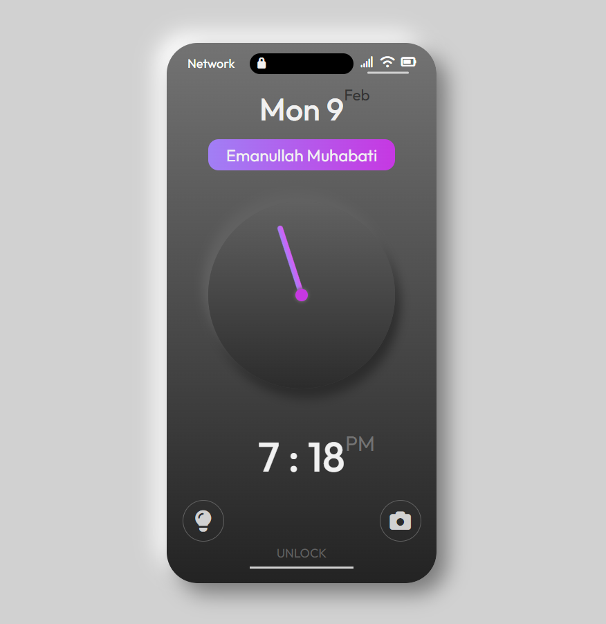

# Neumorphic iPhone Lock Screen Clock

A modern, minimalistic lock screen clock built with a **neumorphic design style**, combining analog and digital time displays for a sleek user experience.
## 📷 Preview

## ✨ Features
- 🕒 Dual display: analog + digital clock
- 🎨 Neumorphic UI with soft shadows and gradients
- 📅 Date and personalized name tag integration
- 🔒 Lock screen shortcuts (flashlight & camera)
- 📱 Optimized for iPhone lock screen aesthetics

## 🚀 Motivation
This project explores **neumorphism in UI design**, blending realism with minimalism to create a smooth, futuristic interface.

## 🛠️ Tech Stack
- Front-end: HTML, CSS, JavaScript

## 📌 Future Improvements
- Support for multiple time zones

## 👨‍💻 Creator
**Emanullah Muhabati**  
Front-end Developer | Civil Engineer | UI/UX Enthusiast

## 🤝 Contributing
Pull requests are welcome! For major changes, please open an issue first to discuss what you’d like to improve.

## 📜 License
This project is licensed under the MIT License.
---
Click[here](https://emanullah-muhabati.github.io/Neumorphic-Clock/)for live demo.
